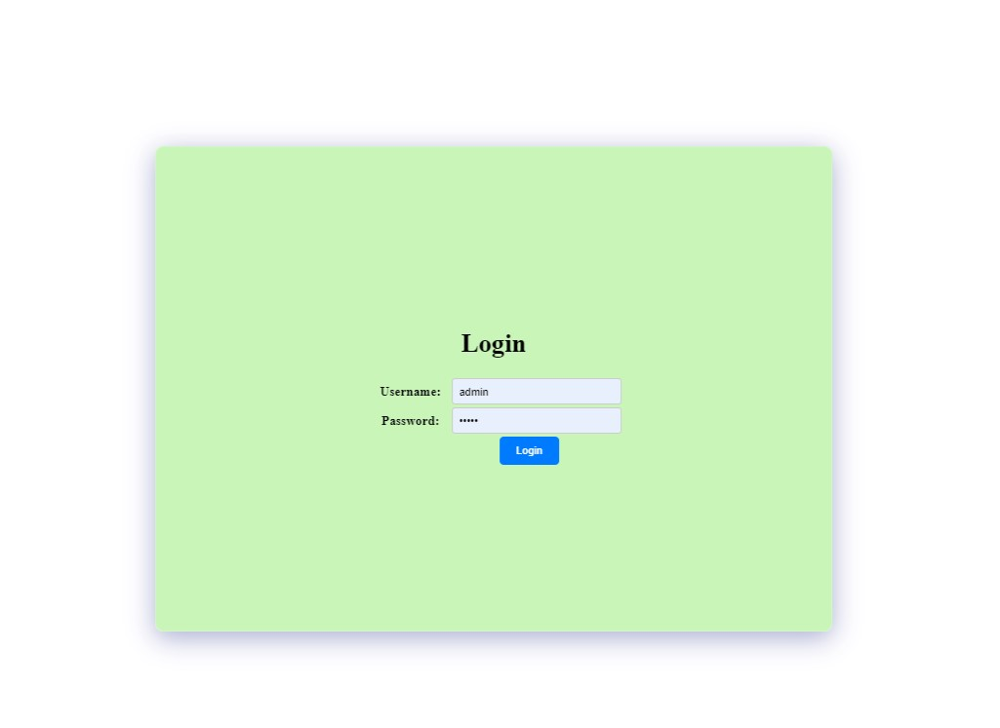
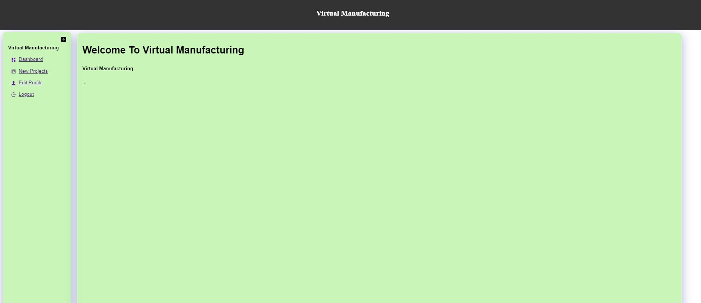
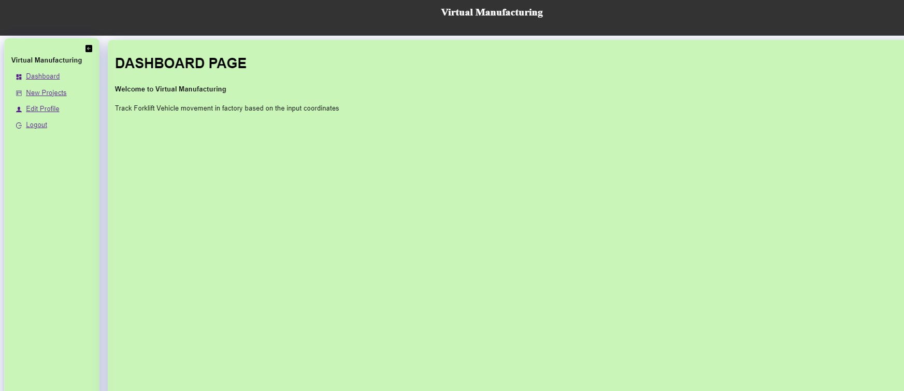
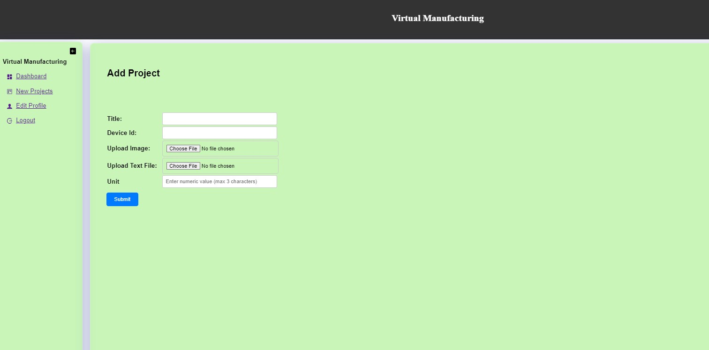
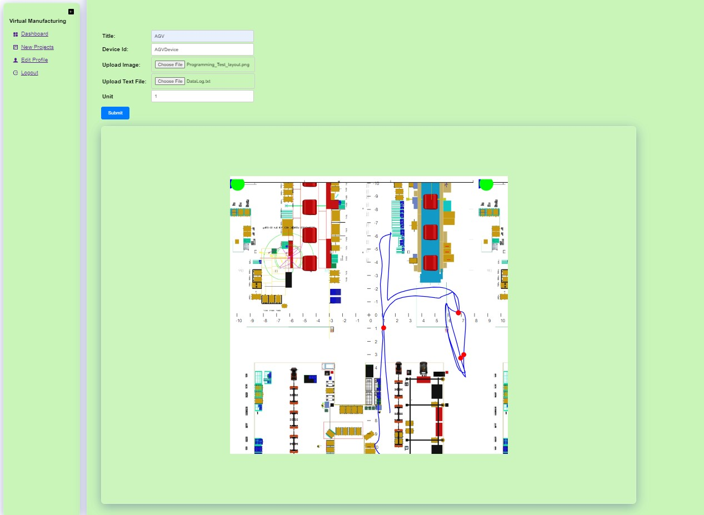
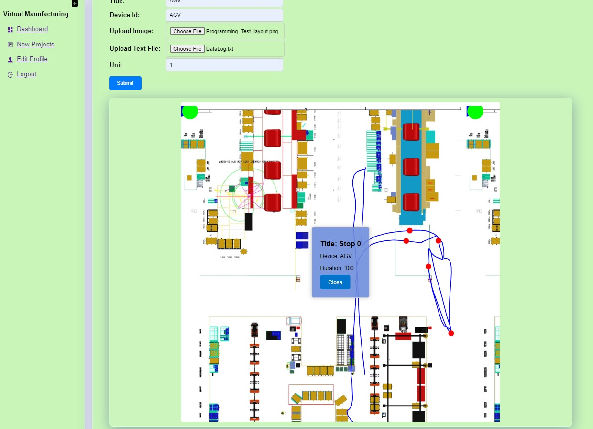
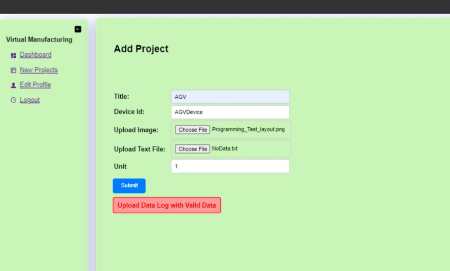

# Virtual Management App

It is a REST API based application developed Using Springboot and React.

The Application will be used to track the forklift movement. A graph will displayed on how the forklift is moved in a plant based 
on the input data (Which have X,Y coordinates).

In order to use the full stack application,
1) Start the Springboot server by running the VirtualManufacturingApplication.java. 
2) Navigate to VM-FrontEnd directory and execute command "npm start"
3) Open browser, and visit "http://localhost:3000/", and the application should be up and running!

# Implementation Strategy:

# Login Screen :
  a.  On Opening the Front end Url , screen will navigate to Login Screen , where user need to provide Username and Password.
    In Memory Springboot Username and password (admin and admin) is used to login.
    On Click of login , a call will be submitted to backend , username and password will be validated against in memory user name and password , if it is successful Application home page will be displayed with a side navigation bar.
    
  b.  User can navigate to different pages like Dashboard , Projects, Edit Profile .
   Dashboard and Edit profile pages are static , only basic content will be displayed.

# New Project
   In New Project user will have the options to Enter Project Title, Device Id , Image upload for factory plant,
   upload data file which contains time, Machine id, X and Y Coordinates and input field to enter Unit for XY axis.
    b. once user enters all data and submit , the image and data file will be stored in Spring boot Project app Directory.
    c. Data Will be parsed and sorted based on time stamp in ascending order , System will ignore the lines which are having less the 6 values.
    d. A stop point list will be prepared based on the input data , Stop points contains Title, Device and Duration .
    e. If there are more than lines in a data file 5 random stop points are taken from the given data , if less than 10 one stop point will be shown.
    f. If all the data is proper backend will send successful response to the client . An image will displayed with path and stop points

# Logic to display Forklift Path.
   a. SVG element is used , polyline and cricle are used to draw the line and stop points respectively
   b. Uploaded image will be displayed on center of the SVG element.
   c. Origin is taken as the center of the SVG
   d. XY coordinates are calculated by taking center of the origin and scale is based on Unit entered by user.
   e. If the Datalog consists of coordinates in the range of -10 to 10 then unit should be given as 1
      If the Data log consists coordinates in range of -20 to 20 then unit should be 2 for example to have a better graph visualisation.
   f. On click of Stop Point The device Id entered by the user, Stop point Title will be displayed.

# Validating Input Data file
    a. If empty data log file or file with less then 6 coordinates is uploaded Error Message will be shown to the user.

# Login Screen

User needs to provide username/password as admin/admin

# Navigation Screen :

1) User can  navigate through different pages

# Dashboard Screen :

1) Screen to input data , upload image and data log.

# New Project Screen :

1) Screen to input data , upload image and data log.

# Result after uploading :

# Popup on Click Of Stop Point:

# Result If empty file is uplaoded :

   
